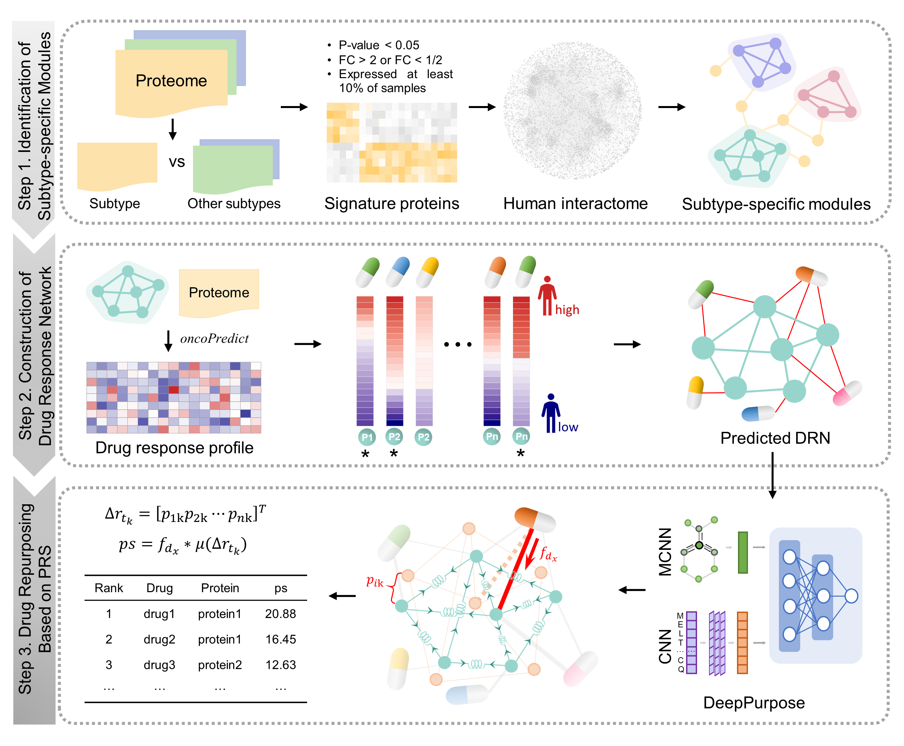

# NetSDR

# Drug repurposing for cancers based on subtype-specific network modularization and drug perturbation analysis

## Framework


## Highlights  
* We proposed the NetSDR framework for drug repurposing for different can-cer subtypes.
*	NetSDR integrated, proteomics and drug sensitivity data by network topol-ogyand biophysics-based analysis.
*	Apply NetSDR to gastric cancer revealed GSK1904529A as a repurposable drug for G-IV by targeting LAMB2.

## Installation
### Requirements
* R
* Anaconda3

This package runs in R, but its functionality depends on Python scripts. Therefore, before using it, you need to create a virtual environment named "py3.9" using anaconda3, with the Python version no lower than 3.7. Please open the Anaconda Prompt and enter the following command:
### Install Python
```
conda create -n py3.9 python=3.9
conda activate py3.9
pip install rdkit
pip install descriptastorus 
pip install DeepPurpose
pip install seaborn
pip install goatools
pip install prody
conda deactivate
```
The Python environment is created to use the DeepPurpose tool and PRS analysis. For more details about DeepPurpose, please visit https://github.com/kexinhuang12345/DeepPurpose.

**Note that the path to the py3.9 environment should be obtained using `conda env list`. In subsequent analyses, this path will be used as a parameter in the functions of NetSDR.**


### Install NetSDR package in R
Use the install_github function from the devtools library to download and install the NetSDR package.
```
install.packages("devtools")
library(devtools)
install_github("Bin-suda/NetSDR")
library(NetSDR)
```

## Usage

### Package organization
```
NetSDR/
├── LICENSE
├── README.md
├── R/           <- Contains R scripts for the above framework calculations.
├── data/        <- Contains data files used by the package.
├── inst/        <- Contains example data and Python scripts.
│     ├── python/           <- Contains some code from enm_package.For more details, please visit https://github.com/oacar/enm_package.
│            └── enm/       <- Source code for enm.
│     ├── extdata/          <- Some example data.
├── man/         <- Contains .Rd help documentation.
├── DESCRIPTION  <- Package metadata.
├── NAMESPACE    <- Package namespace information.
└── NetSDR.Rproj <- Rproject.
```
If installing NetSDR via `devtools` fails, its source code can be directly downloaded. Then, open the `NetSDR.Rproj` file in R and run `devtools::build()` to create a local installation package for local installation.

### Usage Example

#### Step1: Identify subtype-specific modules.
The `getModule` function can identify subtype-specific modules, which accepts three parameters:
* _expr_file_: The path of expression profile. The specific format is referred to in the 'inst/extdata/expression. txt' file or as follow:
  
  || sample1 | sample2 |... |
  | --- | --- | --- | --- |
  | protein1 | 2.345 | 6.480 | ... |
  | protein2 | 7.985 | 4.621  | ... |
  | ... | ... | ...  |...|
  
* _group_file_:  The path of subtype information. In this file, the first column is samples and the second column is subtype grouping.
  
  |Sample| Group |
  | --- | --- |
  | sample1 | group1 |
  | sample2 | group1 |
  | sample3 | group2 |
  | ... | ... |
  
* _sppi_file_: A vector representing the analysis of a specific subtype.

```
data(Expr_Group)
getModule(expr_file, group_file, subtype, ppi_file)
```
The `getModule` function accepts three parameters:
* _exprDF_: A data frame storing expression values, with rows representing proteins and columns representing samples.
* _groupDF_: A data frame storing subtype information, with the first column being samples and the second column being subtype grouping.
* _subtype_: A vector representing the analysis of a specific subtype.

It generates several result files, as follows:
* The signature proteins are saved in the _'signature.csv'_ file.
* The _'edges.txt'_ file stores the subtype-specific network
* The _'node_Module.txt'_ and _'edge_Module.txt'_ files provide information on the nodes and edges of robust modules, respectively.

Then, the module associated with drug response were identified. A drug response network is constructed on this module, and drug repositioning based on PRS is performed.

#### Step2: Build a drug response network.
```
# For example
moduleDF <- Expr[1:50,1:20]
sig_count <- getModuleResponse(moduleDF)
drugDF <- read.csv("calcPhenotype_Output/DrugPredictions.csv",row.names = 1,check.names = F)
DRN_ls <- getDRN(moduleDF,drugDF)
```
At first, it predicts the clinical drug response of patients within a specific subtype based on module expression `moduleDF` specific to that subtype. Then, They are utilized to predict potential interactions between the drug and the protein.
It returns a list containing the drug response network and its node information.

#### Step3: Perform PRS-based Drug Repurposing.
```
# Load the the constructed drug response network (DRN)
data(DRN)
# Load the simplified molecular input line entry system(SMILES) format of the drugs
data(drug_smiles)
# Load the amino acid sequences of the proteins
data(protein_sequences)
# Predict the binding affinity between drugs and proteins
getAffinity(smilesDF=smiles,seqDF=seqs,DRN=DRN,condaenv="C:/Users/A/.conda/envs/DeepPurpose",path="C:/Users/A/DeepPurpose")
# Calculat drug score(ps) using PRS methods for DRN.
getPS(BA_file="result/virtual_screening.txt",PPIN_file="edge.txt",condaenv="C:/Users/A/.conda/envs/DeepPurpose",path="D:/enm_package-master")
```
It initially predicts the binding affinity between drugs and proteins in the DRN, and then performs a drug repositioning method based on PRS to rank the DPIs.

The `getAffinity` function accepts six parameters:
* _smilesDF_: A data frame with two columns named "drug" and "SMILES".
* _seqDF_: A data frame with "protein" and "Sequence" columns.
* _DRN_: A data frame contains two columns: "drug" and "protein".
* _condaenv_: The virtual environment path for DeepPurpose installed using anaconda3.
* _path_: The path where the DeepPurpose package is located.
* _pretrained_model_: The DeepPurpose model type used, which defaults to 'MPNN_CNN_BindingDB_IC50'.
It outputs the results to the "result/virtual_screening.txt" file.

The `getPS` function accepts four parameters:
* _BA_file_: The path to the binding affinity file predicted by the `getAffinity` function.
* _PPIN_file_: The path to the PPI network file (or to a certain module).
* _condaenv_: The virtual environment path for DeepPurpose installed using anaconda3, to maintain consistency in Python.
* _path_: The path to the enm package. Its code is downloaded from https://github.com/oacar/enm_package, which can be placed in any path.
It returns a data frame contains the ps and saves it in the "prs_dti_score.csv" file.

***Run ROC analysis***
```
# Read the file containing the ps scores obtained in the previous step
DPI <- read.csv("prs_dti_score.csv")
DPI <- DPI[,c("Drug.Name","Target.Name","score")]
runROC(pred_DPI=DPI)
```
The parameter _pred_DPI_ of function `runROC` is a data frame contains DPIs and their ps. It perform the ROC analysis for different ps cut-off in sequence and returns their AUCs.

> ***Note:*** _For more detailed information about each function, please refer to the function comments in the respective script._
