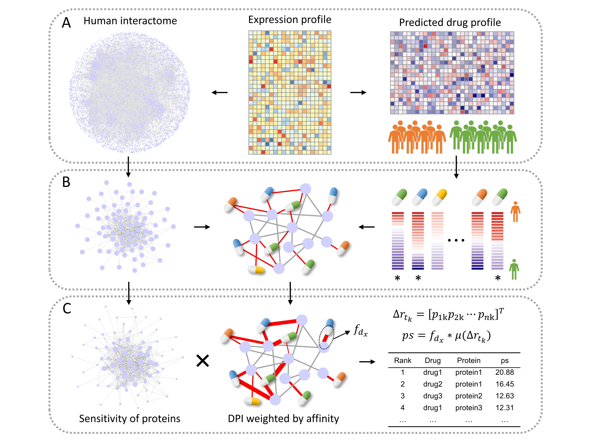

# DRNMDRN

# Drug Repositioning for Cancers - based on network modularization and drug response network

## Graph abstract


## Highlights  
* A comprehensive computational framework integrating expression profiles, network topology, and biophysics is developed.
* The ECM module of G-IV characterized by poor prognosis can also serve as a therapeutic target.
* Combining protein expression with drug sensitivity data guides the construction of drug response networks.
* GSK1904529A displays prospect as a repurposable drug for G-IV by targeting LAMB2.

## Installation
### Requirements
* R
* Anaconda3

### Installation of DRNMDRN
Use the install_github function from the devtools library to download and install the DRNMDRN package.
```
install.packages("devtools")
library(devtools)
install_github("Bin-suda/DRNMDRN")
library(DRNMDRN)
```

### Installation of DeepPurpose and ProDy
Use anaconda3 to install the DeepPurpose tool. Open the command line terminal and enter the following command:
```
git clone https://github.com/kexinhuang12345/DeepPurpose.git
cd DeepPurpose
conda env create -f environment.yml
conda activate DeepPurpose
pip install prody
conda deactivate 
```
For more details about DeepPurpose, please visit https://github.com/kexinhuang12345/DeepPurpose

## Usage

### Package organization
```
DRNMDRN/
├── LICENSE
├── README.md
├── R/           <- Contains R scripts for the above framework calculations.
├── data/        <- Contains data files used by the package.
├── man/         <- Contains .Rd help documentation.
├── DESCRIPTION  <- Package metadata.
└── NAMESPACE    <- Package namespace information.
```

### Usage Example

#### Step1: Identify subtype-specific modules.
```
# Load the proteome expression profiles and grouping information of subtypes.
data(Expr_Group)
getModule(exprDF=Expr,groupDF=Group,subtype="G-IV")
```
The `getModule` function accepts three parameters:
* _exprDF_: A data frame storing expression values, with rows representing proteins and columns representing samples.
* _groupDF_: A data frame storing subtype information, with the first column being samples and the second column being subtype grouping.
* _subtype_: A vector representing the analysis of a specific subtype.

It generates several result files, as follows:
* The signature proteins are saved in the _'signature.csv'_ file.
* The _'edges.txt'_ file stores the subtype-specific network
* The _'node_Module.txt'_ and _'edge_Module.txt'_ files provide information on the nodes and edges of robust modules, respectively.

Then, the module associated with drug response were identified. A drug response network is constructed on this module, and drug repositioning based on PRS is performed.The method and implementation are as shown in the following figure and [**Step 2**](#step2:-build-a-drug-response-network), **Step 3**.


#### Step2: Build a drug response network.
```
# For example
moduleDF <- Expr[1:50,1:20]
data(Expr_Group)
sig_count <- getModuleResponse(moduleDF)
drugDF <- read.csv("calcPhenotype_Output/DrugPredictions.csv",row.names = 1,check.names = F)
DRN_ls <- getDRN(moduleDF,drugDF)
```
At first, it predicts the clinical drug response of patients within a specific subtype based on module expression `moduleDF` specific to that subtype. Then, They are utilized to predict potential interactions between the drug and the protein.
It returns a list containing the drug response network and its node information.

#### Step3: Perform PRS-based Drug Repurposing.
```
# Load the the constructed drug response network (DRN)
data(DRN)
# Load the simplified molecular input line entry system(SMILES) format of the drugs
data(drug_smiles)
# Load the amino acid sequences of the proteins
data(protein_sequences)
# Predict the binding affinity between drugs and proteins
getAffinity(smilesDF=smiles,seqDF=seqs,DRN=DRN,condaenv="C:/Users/A/.conda/envs/DeepPurpose",path="C:/Users/A/DeepPurpose")
# Calculat drug score(ps) using PRS methods for DRN.
getPS(BA_file="data/virtual_screening.txt",PPIN_file="data/edge.txt",condaenv="C:/Users/A/.conda/envs/DeepPurpose",path="D:/enm_package-master")
```
It initially predicts the binding affinity between drugs and proteins in the DRN, and then performs a drug repositioning method based on PRS to rank the DPIs.

The `getAffinity` function accepts six parameters:
* _smilesDF_: A data frame with two columns named "drug" and "SMILES".
* _seqDF_: A data frame with "Protein" and "Sequence" columns.
* _DRN_: A data frame contains two columns: "drug" and "protein".
* _condaenv_: The virtual environment path for DeepPurpose installed using anaconda3.
* _path_: The path where the DeepPurpose package is located.
* _pretrained_model_: The DeepPurpose model type used, which defaults to 'MPNN_CNN_BindingDB_IC50'.
It outputs the results to the "result/virtual_screening.txt" file.

The `getPS` function accepts four parameters:
* _BA_file_: The path to the binding affinity file predicted by the `getAffinity` function.
* _PPIN_file_: The path to the PPI network file (or to a certain module).
* _condaenv_: The virtual environment path for DeepPurpose installed using anaconda3, to maintain consistency in Python.
* _path_: The path to the enm package. Its code is downloaded from https://github.com/oacar/enm_package, which can be placed in any path.
It returns a data frame contains the ps and saves it in the "prd_dti_score.csv" file.

#### Step4: Run ROC analysis.
```
# Read the file containing the ps scores obtained in the previous step
DPI <- read.csv("prd_dti_score.csv")
runROC(pred_DPI=DPI)
```
The parameter _pred_DPI_ of function `runROC` is a data frame contains DPIs and their ps. It perform ROC analysis for different ps cut-off in sequence and returns their AUCs.

> ***Note:*** _For more detailed information about each function, please refer to the function comments in the respective script._
